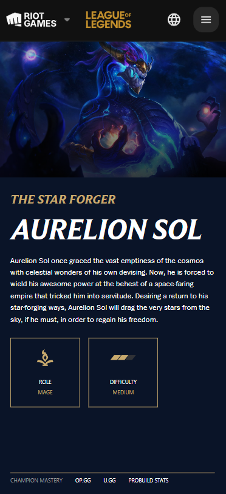
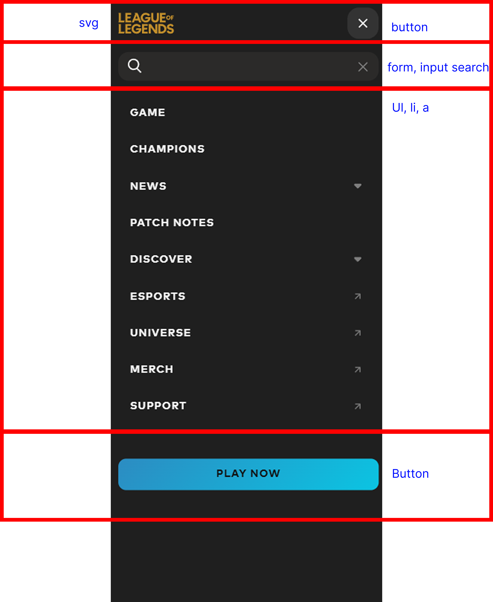
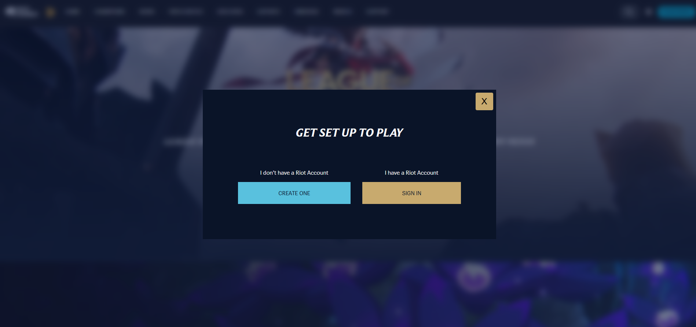
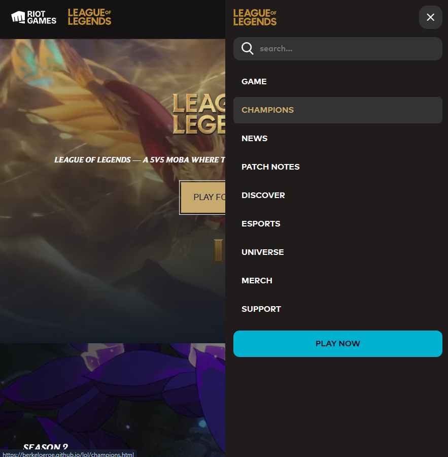

# Procesverslag

Markdown is een simpele manier om HTML te schrijven.  
Markdown cheat cheet: [Hulp bij het schrijven van Markdown](https://github.com/adam-p/markdown-here/wiki/Markdown-Cheatsheet).

Nb. De standaardstructuur en de spartaanse opmaak van de README.md zijn helemaal prima. Het gaat om de inhoud van je procesverslag. Besteedt de tijd voor pracht en praal aan je website.

Nb. Door _open_ toe te voegen aan een _details_ element kun je deze standaard open zetten. Fijn om dat steeds voor de relevante stuk(ken) te doen.

## Jij

  
uitwerken voor kick-off werkgroep

### Auteur:

Randi Berkelaar

#### Je startniveau:

Rood

#### Je focus:

Responsive

## Je website

League of Legends

  
uitwerken voor kick-off werkgroep

### Je opdracht:

https://www.leagueoflegends.com/en-gb/

#### Screenshot(s) van de eerste pagina (small screen):

League of Legends home

#### Screenshot(s) van de tweede pagina (small screen):

Champions | Aurelion Sol pagina

## Toegankelijkheidstest 1/2 (week 1)

  
uitwerken na test in 2e werkgroep

### Bevindingen

Lijst met je bevindingen die in de test naar voren kwamen:

- Geen Darkmode ondersteuning
- Geen Hoog contrast ondersteuning
- Heel veel divs
- Weinig semantische elementen
- Input focus niet altijd duidelijk te zien
- Errors & warnings in de W3AC checker
- Geen goed gebruik van headings soms word een p daarvoor gebruikt
- Missende headings
- Geen alts voor IMG
- Video's hebben autoplay
- Video's geen audio
- Video's hebben geen pauze knop

## Breakdownschets (week 1)

  
uitwerken na afloop 3e werkgroep

### de hele pagina:

  

### dynamisch deel (bijv menu):

  

### wellicht nog een dynamisch deel (bijv filter):

  

## Voortgang 1 (week 2)

  
uitwerken voor 1e voortgang

### Stand van zaken

hier dit ging goed & dit was lastig (neem ook screenshots op van delen van je website en code)

### Agenda voor meeting

samen met je groepje opstellen

| Randi             | Kyra | Aya | Patoune          |
| ----------------- | ---- | --- | ---------------- |
|                   |      |     | Toegankelijke    |
|                   |      |     | Achtergrondvideo |
| responsive Header | Html checken  | Html checken| ...              |

### Verslag van meeting

hier na afloop snel de uitkomsten van de meeting vastleggen

- headings boven aan doen
- Code beter indenten
- Sommige divs kan ik vervangen

## Voortgang 2 (week 3)

  
uitwerken voor 2e voortgang

### Stand van zaken

hier dit ging goed & dit was lastig
- Header was lastig maar is gelukt en hoef niet alles na te maken daarvan.
- Foto aanpassen met een input was lastig maar werkt nu

### Agenda voor meeting

samen met je groepje opstellen

Julia: Mijn YouTube filmpje werkt nog niet. Mag mijn span?
Noa: hoe maak ik mijn 3e sectie scrollende text? hoe doe ik de img animatie 1e sectie?
Melissa:
Randi: achtergrond video toegankelijk, vraag over de header, text aanpassen met css

### Verslag van meeting

hier na afloop snel de uitkomsten van de meeting vastleggen

- Achtergrond video toegankelijk maken door eigen controls toe te voegen.
- Carrousel kan je met css only maken.

## Toegankelijkheidstest 2/2 (week 4)

  
uitwerken na test in 9e werkgroep

### Bevindingen

Lijst met je bevindingen die in de test naar voren kwamen (geef ook aan wat er verbeterd is):

## Voortgang 3 (week 4)

  
uitwerken voor 3e voortgang

### Stand van zaken

hier dit ging goed & dit was lastig
- Carrousel maken was lastig maar is gelukt met hulp van de docent
- Progress bar maken was lastig is gelukt met hulp van de docent
- Progress bar kan beter maar moet ik nog naar kijken

### Agenda voor meeting

samen met je groepje opstellen
Noa 
Melissa
Julia: 
Randi: Hamburger menu werkt niet op mijn tweede pagina

### Verslag van meeting

hier na afloop snel de uitkomsten van de meeting vastleggen

- Er was een javascript conflict waardoor het hamburger menu op de tweede pagina niet werkte

## Eindgesprek (week 5)

  
uitwerken voor eindgesprek

### Je uitkomst - karakteristiek screenshots:

 

### Dit ging goed/Heb ik geleerd:

Korte omschrijving met plaatjes

Een modal maken was best makkelijk

De header / het hamburger menu was denk ik wel het meest uitdagende maar met beetje hulp is het gelukt.

Een css only carrousel maken was nieuw voor mij en heb ik geleerd met anchor positioning

Een achtergrond video toegankelijk maken door eigen video controls toe te voegen

Ik weet nu hoe je grid layouts kan maken.

Een skiplink toe voegen om naar de main content te gaan

### Dit was lastig/Is niet gelukt:

Korte omschrijving met plaatjes

                                  

## Bronnenlijst

  
continu bijhouden terwijl je werkt

Nb. Wees specifiek ('css-tricks' als bron is bijv. niet specifiek genoeg).
Nb. ChatGpT en andere AI horen er ook bij.
Nb. Vermeld de bronnen ook in je code.

1. https://dlo.mijnhva.nl/d2l/le/content/702741/Home
2. https://codepen.io/Berkeloeroe/pen/MYwEJPv?editors=1010
3. https://chatgpt.com/
4. https://www.youtube.com/watch?v=wh1FKjZt_H8
5. https://www.a11yproject.com/posts/how-to-hide-content/
6. https://cssgrid-generator.netlify.app/
7. https://www.freeformatter.com/css-beautifier.html#before-output

